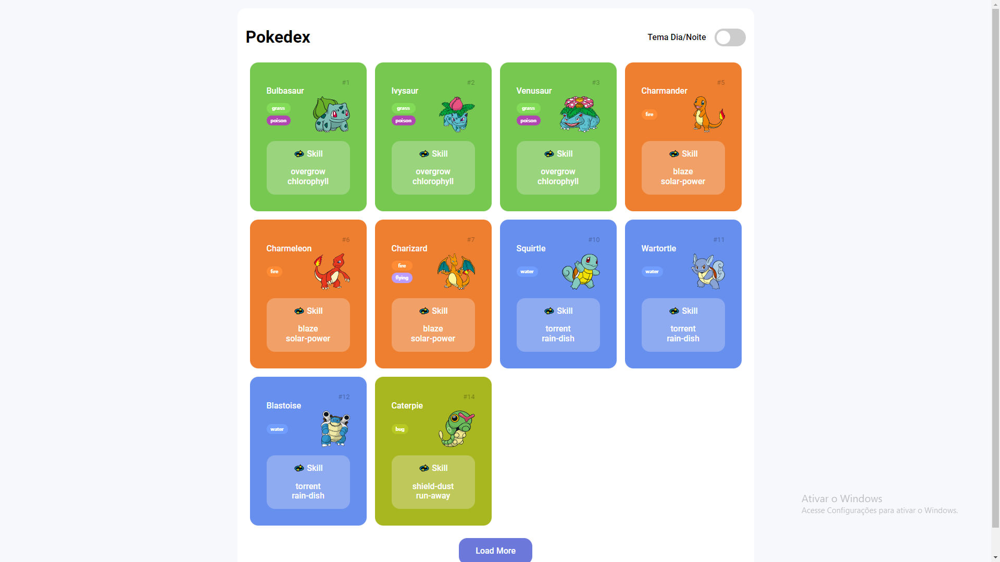
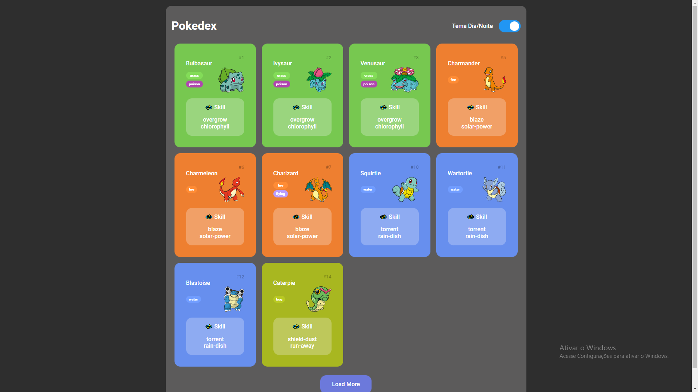

# Construindo um Pokedex com Javascript (Desafio 4)

Desafio Frontend da DIO

* Pokedex que faz requisição da PokeApi.
* App Responsiva
* Modo Noturno

[Projeto Base](https://github.com/digitalinnovationone/js-developer-pokedex)

### Resultado

https://pokedex-js-eta.vercel.app/

